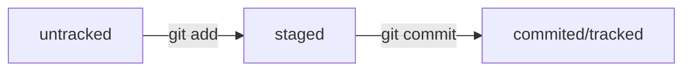
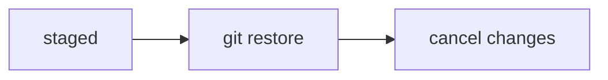
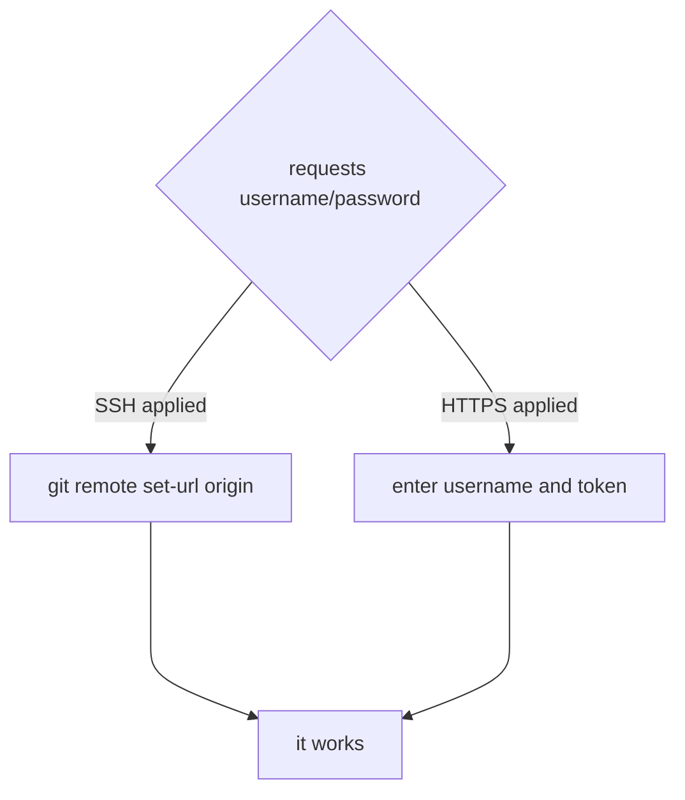

# Git and Github Course

Crash course Git

some new test text

```mermaid
graph LR;

	untracked -- "git add" --> staged;
	staged -- "git commit" --> commited/tracked;

```

```mermaid
graph LR;
    markdown[staged]
    newLines["git restore"]
    result["cancel changes"]
    markdown --> newLines --> result


```

```mermaid
flowchart TD;
	A{requests username/password};
	A -- SSH applied --> B[git remote set-url origin];
	A -- HTTPS applied --> C[enter username and token];
	B ----> D[it works];
	C ----> D[it works];


```

