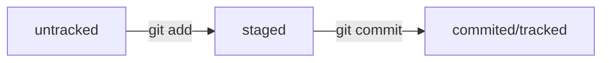
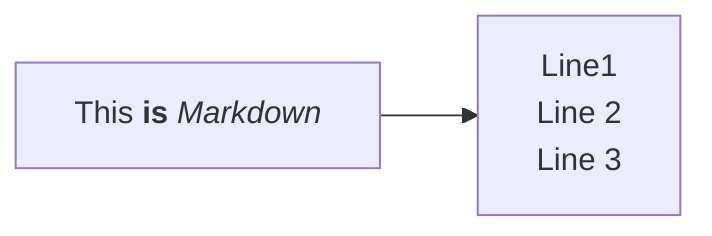

# Git and Github Course

Crash course Git

```mermaid
graph LR;

	untracked -- "git add" --> staged;
	staged -- "git commit" --> commited/tracked;

```

%%{init: {"flowchart": {"htmlLabels": false}} }%%

```mermaid
graph LR;
    markdown["`This **is** _Markdown_`"]
    newLines["`Line1
    Line 2
    Line 3`"]
    markdown --> newLines


```

